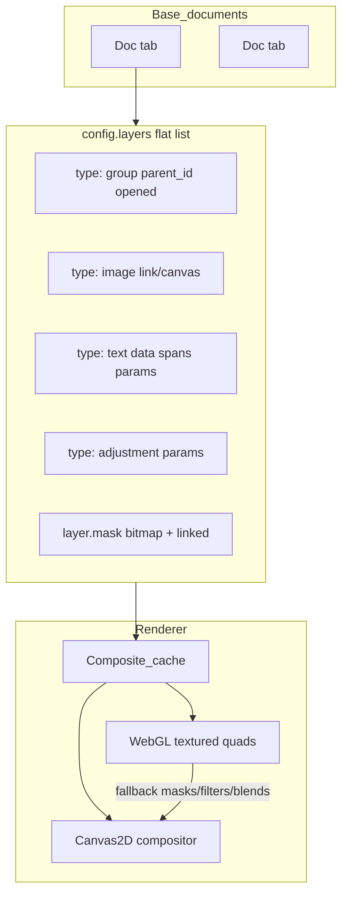

# Vantage Point Roadmap — Dethroning Photopea

**Product:** Vantage Point / PhotoChop (package `vantage-point`)  
**Repo:** https://github.com/mjmacfadden/photochop  
**Upstream:** heavily forked miniPaint (MIT)  
**Audience:** Mike + Tom (founder/engineer working doc)  
**Date:** 2026-09-01 (America/Chicago)  
**Ground truth:** `photochop-CODE_REVIEW.md`, `photochop-psd-p0-fix.md`, `photochop-text-tool-notes.md`, live tree on `feature/layer-tree` (+ merged PSD P0 / text-tool work)

This is a working roadmap, not a pitch deck. Numbers that are not measured are marked as targets, not claims.

---

## 1. Executive thesis

**Where we are.** Vantage Point is no longer “miniPaint with a logo.” The live fork already has multi-document tabs (`base-documents.js`), first-class layer masks (`mask.js`), adjustment layers in the compositor (`base-layers.js`), a Canvas2D + WebGL renderer factory with `Composite_cache`, IndexedDB recovery, and **bidirectional PSD via `ag-psd` in `src/js/libs/psd.js`**. As of 2026-09-01, P0 PSD export bugs (`app.Base_layers` → `app.Layers`, mask `positionRelativeToLayer`) are fixed on `fix/psd-export-p0` / merged into the text branch; point/paragraph text and styleRuns/rotation export landed on `fix/text-tool-photoshop`; **layer groups / tree model are in progress on `feature/layer-tree`** (`layer-tree.js`, `modules/layer/group.js`, gui-layers wiring).

**The wedge vs Photopea.** Photopea ([photopea.com](https://www.photopea.com/)) is the incumbent browser Photoshop-class editor: client-side, deep PSD/AI/RAW/vector support, ~decade of solo-dev polish, free with sidebar ads / ~$5/mo Premium. It also **feels stale**—UI density and visual craft have not kept pace with modern web products (Figma, Affinity, Pixlr’s AI-forward surfaces). Our wedge is not “clone every Photopea checkbox.” It is:

1. **PSD round-trip that professionals trust for the 80–90% of daily layer work** (open → edit layers/masks/groups/adjustments/text → save → reopen in Adobe Photoshop / Photopea without silent structure loss).
2. **A modern, dense, beautiful UI** that makes Photopea feel like 2014.
3. **Ruthless performance** on mid-range laptops: GPU-first compositing, workers, memory budgets—still 100% client-side.
4. **Privacy as product:** files never leave the device (same claim Photopea makes—we make it the brand center, not a footnote).

**What “win” means in 12–24 months.**

| Horizon | Win definition |
|--------|----------------|
| 6 months | Power users choose Vantage Point for “open PSD, fix layers/text, export” over Photopea when UI/ads annoy them; group hierarchy + clipping/blend survive round-trip. |
| 12 months | Default recommendation in “browser Photoshop alternative” lists *alongside* Photopea for raster/PSD workflows; measurable retention on return visits (PWA). |
| 24 months | Preferred *daily driver* for freelancers/students/small studios who need PSD interchange but not Adobe ecosystem lock-in; Photopea still wins edge formats (AI, some vectors, RAW depth)—we own the core edit loop and craft. |

We do **not** need Adobe feature parity. We need to be the best place to do the work people actually do in a browser, with files that still open in Photoshop.

---

## 2. Architecture deep analysis

### 2.1 Stack (honest)

| Layer | Reality |
|-------|---------|
| Boot | `main.js` singletons on `app` + `window.*` (miniPaint DNA) |
| Config | Global mutable `config.js` (layers, COLOR, ZOOM, TOOLS) |
| UI | jQuery + Alertify + custom `popup.js`; eager `require.context` module registry in `base-gui.js` |
| Build | webpack 5 → `dist/bundle.js` (~1.6MB) + extracted `styles.css`; no content hashes; SW `photochop-shell-v2` |
| Docs | `Base_documents` multi-tab |
| Layers | Flat `config.layers` array; **new** `parent_id` + `type: "group"` tree helpers |
| Render | `renderer/` — Canvas2D, WebGL2/1, `Composite_cache` (document + prefix canvases in document space) |
| PSD | `libs/psd.js` + `ag-psd@31.0.2` |
| Recovery | IndexedDB `photochopRecovery` + legacy localStorage quicksave |

**Strength vs Photopea’s closed stack:** we can iterate in the open (or closed) with a modular renderer boundary already sketched. **Weakness:** globals + eager registry + committed `dist/` + no `.gitignore` / tracked `node_modules` (P0 hygiene from the code review) will grind velocity and scare collaborators.

### 2.2 Document & layer model



- Raster: `type: "image"`, optional `data` dataURL (memory-heavy when both canvas + dataURL exist).
- Text: vector-ish `data` lines/spans + `render_function: ["text","render"]`.
- Adjustment: full-doc bounds, applied in compositor.
- Mask: `{ link, x, y, width, height, enabled, linked }` — PSD maps `linked` ↔ ag-psd `positionRelativeToLayer` (fixed P0).
- Clipping: still approximated as `composition: "source-atop"` (drops concurrent blend)—**tech debt that blocks parity**.
- Groups (WIP): `parent_id`, `opened`, `composition: "pass-through"`; compositor currently pass-through (skip group node, paint children in global order).

### 2.3 Renderer path

`create_renderer('auto'|'canvas2d'|'webgl')` (`renderer/index.js`):

- **WebGL** (`webgl-renderer.js` ~24KB): layers as textured quads, opacity, normal blend; offscreen GL → blit to main 2D canvas for overlays. **Falls back to Canvas2D** when filters, non-`source-over` composition, or masks are present (`can_render_layers`).
- **Canvas2D** + **`Composite_cache`**: document-space cache; interactive transforms reuse prefix; viewport zoom/pan does not rebuild the stack.
- Demand-driven invalidation already landed (`PERFORMANCE.md`): idle = no render; histogram in worker; GIF/TIFF lazy chunks.

**Debt blocking vision:** GPU path is a fast path for “simple stacks,” not the default truth for Photoshop-like docs (masks + blend + adjustments). WebGPU / OffscreenCanvas workers are not started. ag-psd is eagerly in the main graph.

### 2.4 PSD pipeline

```
Open .psd → open.js readAsArrayBuffer → load_psd()
  → convert leaf layers / text / adjustment / effects
  → Documents.create_document_from_psd_data() | Insert_layer_action

Save PSD → save.js → export_psd(layers, W, H)
  → export_layer_to_psd → writePsd → FileSaver
```

Import strengths: masks, many blends (lossy map), effects→filters, adjustments, text styleRuns→spans, transform.  
Export (post-P0/text work): composite via `app.Layers`, mask link polarity correct, text styleRuns + rotation + point/box.  
Still weak: **groups flattened in `collectLayers`** (layer-tree branch must reverse this), clipping vs blend, effects mostly drop-shadow on export, hue/sat adjustments not re-exported, smart objects / vectors / CMYK / 16-bit / PSB out of scope for ag-psd.

### 2.5 Where tech debt blocks the product

1. **Group round-trip** — without it, “open client PSD” loses the mental model of the file.
2. **Clipping + blend** — real marketing/PSD files use both.
3. **WebGL fidelity gap** — performance story collapses on the docs we care about.
4. **Repo hygiene** — no `.gitignore`, tracked `node_modules`/`archived/`, stale miniPaint README/SECURITY, keys in `config.js`.
5. **Architecture gravity** — globals make testing and “amazing UI” rewrites expensive; gradual modularization required, not a big-bang rewrite.

---

## 3. Competitive teardown: Photopea & others

Sources: [Photopea](https://www.photopea.com/), DigiTools/ToolChase 2026 reviews, SoftLookup / EditPSDFile / Founding.dev roundups (2026).

| Dimension | Photopea | Vantage Point (now) | Pixlr E/X | Polarr | BeFunky | Penpot | Adobe PS Web |
|-----------|----------|---------------------|-----------|--------|---------|--------|--------------|
| PSD R/W depth | Category leader (smart objects, effects, vectors…) | Real but incomplete (groups WIP; clipping/blend; effects one-way) | Partial / not the product | Weak | Weak | N/A (design) | Ecosystem native (if/when offered) |
| Client-side | Yes (CPU/GPU local) | Yes | Mixed / account-centric | Browser | Browser | Cloud collab | Adobe cloud |
| UI craft | Functional, dated | Improving; still miniPaint bones | Modern / AI-forward | Photo-presets | Consumer | Design-tool modern | Adobe |
| Ads | Free tier sidebar ads | None (opportunity) | Freemium friction | Freemium | Freemium | Open | Subscription |
| AI features | BG remove, generative hooks | Not a bet yet | Strong | Color AI | Consumer AI | — | Firefly |
| Formats | 40+ (AI, PDF, RAW, Figma…) | Raster + PSD + common web | Narrower | Photo | Photo | Design files | Full Adobe |
| Team | Solo (Ivan Kutskir) since ~2013 | Mike + Tom | Company | Company | Company | OSS org | Adobe |

**What Photopea still wins on (be honest):**

- Compatibility depth (smart objects, paths/vectors, layer styles fidelity, RAW, exotic formats).
- Shortcut / muscle-memory surface area vs Photoshop.
- Years of edge-case PSD battle scars.
- Brand = “free Photoshop in the browser.”

**Photopea’s stale UI as opportunity:** denser panels, better typography/theming, less chrome noise, no ad column stealing horizontal space, modern selection/transform handles, onboarding that doesn’t assume 2003 Photoshop literacy *or* clone it blindly.

**Honest gaps we must not paper over:** smart objects, vector/pen tooling, RAW pipeline, Puppet Warp / Liquify parity, and “open any agency PSD untouched” will lag for a long time. Own the gap: *“Built for the edit loop you do every day—not every checkbox Adobe ever shipped.”*

---

## 4. Product strategy: 80–90% that matters

### Explicit goals (steal Photopea/PS users)

1. **Open PSD** → layers visible, ordered, grouped, masked, blended.
2. **Edit** → move/transform, paint/mask, adjust, type (point + paragraph), group/ungroup, duplicate, opacity/visibility.
3. **Save PSD** → reopen in Photoshop without “where did my folders go?” and without flipped mask links.
4. **Export** → PNG/JPEG/WebP/GIF/TIFF reliably; PSD as master.
5. **Multi-doc** → tabs already exist; polish.
6. **Offline/PWA** → shell SW already; tighten caching policy.

### Explicit non-goals (bloat to skip for 12+ months)

- Full Camera Raw / tethered shooting.
- Full Illustrator/vector suite (basic shape tools OK; Pen tool depth later).
- 3D, video timeline, animation.
- Cloud collab / multiplayer (privacy wedge first; optional later).
- Plugin marketplace v1.
- Matching Photopea’s 40-format zoo (add formats only when a persona screams).
- Electron desktop shell (browser + PWA only).

### Personas & journeys

| Persona | Journey | Must-not-break |
|---------|---------|----------------|
| Freelancer | Client sends PSD → fix text/logo layer → export PNG + return PSD | Groups, text, masks |
| Student | Homework composite without Creative Cloud | Layers, free forever, no ads |
| Social/ecom | Product shot → mask → adjust → export WebP | Speed, simple UI |
| Photopea refugee | Same shortcuts-ish, better UI, no ads | Muscle memory for core tools |

---

## 5. Compatibility roadmap (ag-psd maximized)

ag-psd is implemented against Adobe’s [Photoshop File Format Specification](https://www.adobe.com/devnet-apps/photoshop/fileformatashtml/) (documented format—not reverse-engineering mythology). Known library limits: no CMYK/Indexed/LAB write beyond RGB, no 16-bit, no PSB, incomplete text, no pattern overlay depth, smart-object filters limited ([ag-psd README](https://www.npmjs.com/package/ag-psd)).

### Phase A — Trust (Q0–Q1) — exit: “round-trip demo reel”

- [x] Export composite uses `app.Layers` (P0 done).
- [x] Mask `positionRelativeToLayer` polarity (P0 done).
- [x] Text styleRuns + rotation + point/box export (text branch).
- [x] **Groups:** stop flattening in `collectLayers`; import `children` → `type: "group"` + `parent_id`; export nested `children` (align with `layer-tree.js` / `count_psd_nodes` / `is_psd_group`). Verified: `import_psd_nodes` + `build_psd_children_tree` in `src/js/libs/psd.js`.
- [ ] Bundle `asLayers` inserts in one `Bundle_action`.
- [ ] Avoid `safeToDataURL` on every raster when `link` canvas suffices.
- [ ] Manual regression suite from code review Appendix B (automate later).

### Phase B — Structure fidelity (Q1–Q2)

- Clipping **and** blend (separate flags; stop overwriting `composition` with only `source-atop`).
- Effects export parity with import (outer/inner glow, stroke—not only dropShadow).
- Adjustment export: hue-rotate / saturate.
- Pass-through vs blended groups in compositor (not only UI preserve).
- Font name mapping table + missing-font UX.

### Phase C — Smart-lite & depth (Q3–Q4)

- **Smart objects lite:** preserve as linked/embedded raster + placeholder metadata; edit = rasterize with warning (full SO editing is a multi-year trap).
- Layer FX round-trip expansion within ag-psd support.
- Color mode honesty: detect CMYK/16-bit on import → convert with loud banner; never silently claim parity.
- Optional: contribute upstream fixes to ag-psd where we hit library walls.

### Phase D — Stretch (year 2)

- Paths / vector shapes subset; PSB exploration only if library gains support; layer comps as read-only notes.

---

## 6. UI/UX roadmap — “amazing, not stale”

**Principle:** Photopea proved Photoshop *layout* works in a browser. We prove **2026 craft** can coexist with pro density—no Electron.

| Track | Direction |
|-------|-----------|
| Design system | Tokens (spacing, type, color, elevation); dark-first + light; CSS variables; kill one-off Alertify look over time |
| Density | Compact Layers / Properties; collapsible panel chrome; optional “Zen” distraction-free canvas |
| Layers panel | Tree indent, chevrons, drag-reparent (`Layer_group.reparent`), mask/adj icons, smart thumbnails |
| Canvas | Modern transform handles, better marching ants (interval path already improved), crisp DPR |
| Onboarding | First-run: open sample PSD, 60-second tour; “files never leave this device” badge always visible |
| A11y | Keyboard panel focus, contrast, reduce `innerHTML` sinks (security + a11y) |
| Theming | User accent; optional Photopea-adjacent layout preset vs “Vantage” preset |
| Branding | Settle **Vantage Point** as public name; PhotoChop as codename/repo OK |

Contrast vs Photopea: no ad column; typography hierarchy; quieter icons; motion that is purposeful (panel open, not gimmick).

---

## 7. Performance roadmap (GPU/CPU, client-side only)

**Constraint sacred:** no server-side pixel pipeline for core edit. Optional cloud later must be opt-in and never required for PSD open/save.

### Near term (Q0–Q1)

- Dynamic `import()` for `ag-psd` / `psd.js` on first PSD open (bundle size).
- Lazy swatch data (`gui-swatches-data.js` ~124KB).
- Stop dual canvas+dataURL memory spikes on PSD import.
- SW: precache shell only; bump `CACHE_NAME` on every release; don’t cache arbitrary same-origin GETs forever (code review).

### Mid (Q2–Q3)

- Deepen WebGL: mask sampling, multiply/screen/overlay blend shaders, adjustment shaders where tractable; keep Canvas2D as correctness oracle.
- OffscreenCanvas + worker for histogram-class and export encode (patterns in [MDN OffscreenCanvas](https://developer.mozilla.org/en-US/docs/Web/API/OffscreenCanvas), worker GPU notes 2025–2026).
- Tile or pyramid caches for ≥4K; interactive quality tier (half-res while dragging).
- Memory budget UI: soft warn at N MB of layer bitmaps; offer “flatten hidden” / “purge undos.”

### Longer (Q4+)

- WebGPU compute path behind flag (Chrome/Edge/Firefox maturity); WGSL for blur/levels; fallback WebGL2.
- SharedArrayBuffer only if COOP/COEP acceptable for the host story—don’t block PWA on fancy shared memory.

### Targets (measure, don’t invent)

| Scenario | Target |
|----------|--------|
| Idle CPU | ~0 composite (already directionally true) |
| 2K, 20 raster layers, pan/zoom | 60 fps feel on mid laptop |
| 4K, 50 layers with masks | Interactive >15 fps; commit <1s rebuild |
| 8K | Open + view + crop/export; full paint optional |
| First PSD open cold | Lazy parse; show progress |

Benchmark plan: fixed fixture PSDs in private `fixtures/` (not giant binaries in git); scripts logging `performance.now()` around `load_psd` / `export_psd` / full composite; weekly smoke on Chrome + Firefox + Safari.

---

## 8. Engineering roadmap (phased quarters)

### Q0 — Now (ship the foundation)

**Exit criteria:** layer tree usable; text+PSD P0 on mainline; repo not a dumpster.

- Merge `fix/text-tool-photoshop` + `fix/psd-export-p0` → master.
- Finish `feature/layer-tree`: panel tree, new/group/ungroup, reparent DnD, **PSD import/export groups**.
- Land or shelve `feature/swatch-panel` cleanly (don’t mix with tree).
- Hygiene: `.gitignore`, untrack `node_modules`/`archived/**/node_modules`, decide `dist/` policy (prefer CI artifacts).
- Rotate/remove Pixabay & Google keys from `config.js`; lock `?image=` open.
- Rewrite README/SECURITY for Vantage Point.

### Q1

- Clipping+blend model; effects/adjustment export gaps.
- Lazy PSD + start WebGL mask/blend slice.
- Design-system spike (tokens + Layers/Properties restyle).
- Smoke tests: PSD round-trip raster/mask/text/group; text undo; linked mask move.

### Q2

- UI density pass v1; shortcut audit vs common PS/Photopea bindings (subset, documented).
- Worker export + memory budget meter.
- Smart objects lite (preserve/rasterize).
- Positioning site + privacy page.

### Q3

- Performance campaign on 4K fixtures; WebGPU prototype behind flag.
- Onboarding + sample files; a11y pass.
- Decide license posture formally (attorney).

### Q4

- “1.0” compatibility badge: published matrix of supported PSD features.
- PWA install polish; optional paid “Pro” only if freemium story clear (ad-free is free for us—monetize templates/priority/support or future cloud).
- Architecture: extract `DocumentModel` / `Compositor` modules with thin adapters to `config`—**gradual**, not rewrite.

**Rewrite risk:** a greenfield React/Canvas rewrite loses 12 months and PSD scars. Prefer strangler pattern around `renderer/`, `psd.js`, and new UI panels.

---

## 9. Go-to-market & positioning

**Name:** Public **Vantage Point**; repo/codename PhotoChop OK. Package already `vantage-point`.

**Language (trademark-safe):** Prefer “browser image editor with strong **PSD compatibility**,” “works with Photoshop documents,” “alternative to subscription desktop editors.” Avoid product names like “Photoshop online,” Ps-lookalike icons, or “Photoshop clone” in official marketing. Adobe’s [trademark guidelines](https://www.adobe.com/legal/permissions/trademarks.html) restrict using Adobe marks in product/company/domain names and require careful referential use. PSD as a *format* is documented by Adobe; trademarks are not free to brand on.

**Positioning line (draft):**  
*Vantage Point — professional layer editing in your browser. Your files never leave your device.*

**Open vs closed:** see §10. GTM can ship a free client regardless of license.

**Privacy weapon:** equal claim to Photopea’s “no uploads”—lean harder: offline-capable PWA, transparent SW, no account required for core edit.

**Channels:** Product Hunt / HN when group+PSD round-trip demo is undeniable; YouTube “open this PSD without Adobe”; student Discord/Reddit; contrast ads-free vs Photopea free tier.

---

## 10. IP & legal options

> **Not legal advice.** This section is educational framing for founder discussion. **Talk to an IP attorney before choosing a license, CLA, or trademark filing.**

### Copyright & MIT upstream

- miniPaint is MIT. MIT allows use, modification, private use, sublicensing, and selling **provided** copyright and permission notices are preserved for substantial MIT portions ([notice obligations](https://writing.kemitchell.com/2022/03/07/Switching-Open-Software-Terms.html)).
- **New code you write** can be licensed differently going forward; old MIT-covered work remains MIT. You cannot “erase” MIT from retained upstream code.
- Practical: keep a `THIRD_PARTY_NOTICES` / LICENSE section listing miniPaint (Vilius L. et al.), ag-psd, and other deps.

### What you can / cannot close-source

| Action | Generally OK under MIT? |
|--------|-------------------------|
| Ship proprietary binary/app that includes MIT code + notices | Yes |
| Keep your GitHub private while developing | Yes |
| Relicense *your* new files as proprietary | Yes |
| Remove MIT notices for retained miniPaint code | **No** |
| Prevent others from using *old public MIT commits* | **No** (already published) |
| Dual-license your original work | Yes (with clear ownership) |

### Strategy matrix

| Option | Pros | Cons | Fit |
|--------|------|------|-----|
| Stay MIT (fully open) | Community, trust, hiring | Easy for Photopea-class clone of *your* UI/PSD work; hard to sell exclusivity | Good if growth > IP |
| Dual-license (MIT + commercial) | Familiar pattern | Needs clear ownership/CLA | Possible later |
| Source-available (BSL/SSPL-like) | Limits cloud freeloaders | Controversial; not “Open Source”; community chill | Weak fit (we’re client-side) |
| **Proprietary app + MIT dependency attribution** | Protects UX/PSD investment; simple story | Must maintain notices; prior public commits stay MIT | **Strong default while competing** |
| Open core (engine MIT, Pro UI/cloud closed) | Marketing “open” + revenue | Boundary discipline hard | Year-2 option |
| Free client forever + paid cloud later | Privacy brand intact | Cloud isn’t needed yet | Compatible with proprietary *or* MIT client |

### Trademarks & trade secrets

- File for **Vantage Point** (and logo) in relevant classes when name locks.
- Do not use Adobe marks in name/domain/icon; use “PSD-compatible” / “Photoshop document” referentially and accurately.
- Trade secrets: keep fixture corpora, unreleased heuristics, and brand strategy private even if code is open.

### Patents / CLA

- Patents are usually weak/costly in this UI+format space—deprioritize.
- If open: use a CLA or DCO so relicensing stays possible.

### Practical recommendation (default until counsel says otherwise)

**Default: proprietary (or private source-available) product distribution with full MIT attribution for miniPaint and other OSS deps; do not rush BSL/SSPL; keep the client free and local; revisit open-core after 1.0 compatibility matrix and trademark filing.**

Decision criteria for the attorney meeting: (1) will we accept forks of our PSD/UI work? (2) do we need paid enterprise later? (3) are we taking outside contributors? (4) which commits are already irrevocably MIT-public?

---

## 11. Risk register

| Risk | Likelihood | Impact | Mitigation |
|------|------------|--------|------------|
| Adobe perception / trademark complaint | Low–med | High | Careful language; no Ps mimicry; attorney review of marketing |
| Photopea ships UI refresh or undercuts | Med | Med | Win on craft + groups demo speed; don’t rely on “they’re stale forever” |
| Browser memory ceilings | High | High | Budgets, tiling, lazy bitmaps, honest 8K limits |
| Fork brand confusion (miniPaint / PhotoChop / Vantage) | High | Med | Rename UI strings, README, domains; one public name |
| Key-person risk (2 people) | Med | High | Docs (this), tests, modular PSD/renderer boundaries |
| “PSD reverse engineering” FUD | Med | Med | Cite Adobe’s public file format spec + ag-psd; transparency page |
| Hygiene/security incident (keys, XSS) | Med | High | P0 hygiene + CSP + kill `innerHTML` sinks |
| ag-psd ceiling (no PSB/16-bit) | High | Med | Honest matrix; upstream contrib; don’t overclaim |

---

## 12. 90-day action plan

Concrete checklist for Mike + Tom. Weeks assume start **2026-09-01**.

### Weeks 1–2 — Stabilize & hygiene

- [x] Merge text-tool + PSD P0 to master (PRs #12–#15: layer-tree, swatches, Type Tool, text-resize). Tagged build still optional.
- [ ] Add `.gitignore`; stop tracking `node_modules` / `archived/**/node_modules`; document `dist/` policy.
- [ ] Remove/rotate API keys; restrict remote `?image=` opens.
- [ ] README + SECURITY rewrite (Vantage Point, PSD, vulnerability contact).
- [x] Land layer-tree panel basics (chevron, indent, new group, ungroup).

### Weeks 3–4 — Groups round-trip

- [ ] PSD import: map `children` → group layers (`layer-tree` helpers).
- [ ] PSD export: emit nested `children` / `opened`.
- [ ] Manual fixtures: folders, nested folders, visibility, pass-through.
- [ ] Finish DnD reparent; fix delete/duplicate for subtrees (already touched on branch).

### Weeks 5–6 — Fidelity & perf quick wins

- [ ] Clipping + blend coexistence design + implement.
- [ ] Effects export: glow/stroke; adjustment hue/sat export.
- [ ] Dynamic import ag-psd; drop unnecessary toDataURL.
- [ ] SW precache-only tightening + CACHE_NAME bump discipline.

### Weeks 7–8 — UI craft spike

- [ ] Tokenized dark theme; Layers + Properties restyle.
- [ ] Canvas DPR/handles polish; privacy badge in chrome.
- [ ] Swatch panel: merge or park—no half-wired dual systems. (Note: Swatches panel already merged via PR #13 / feature/swatch-panel; tokenized restyle still open.)

### Weeks 9–10 — Proof & positioning

- [ ] Record “agency PSD open → edit → save → Photoshop” video.
- [ ] Publish internal compatibility matrix (public draft).
- [ ] Trademark search for “Vantage Point”; schedule IP attorney hour.
- [ ] Shortcut sheet v0 (documented subset).

### Weeks 11–12 — Harden

- [ ] Automated smoke: group/mask/text round-trip; text undo; linked mask.
- [ ] Memory warn + 4K fixture benchmark baseline.
- [ ] Decide Q1 license posture (per §10 default).
- [ ] Roadmap review: kill anything not serving PSD trust or UI craft.

---

## Appendix — Key paths

| Path | Role |
|------|------|
| `src/js/libs/psd.js` | PSD import/export |
| `src/js/libs/layer-tree.js` | Group tree model (WIP) |
| `src/js/modules/layer/group.js` | Group UX actions |
| `src/js/core/base-layers.js` | Compositor, adjustments, masks |
| `src/js/core/renderer/*` | Canvas2D / WebGL / cache |
| `src/js/core/base-documents.js` | Multi-doc + PSD handoff |
| `src/js/tools/text.js` | Text tool |
| `src/js/modules/mask/mask.js` | Mask editing |
| `service-worker.js` | App shell PWA |
| `PERFORMANCE.md` | Perf worklog |

## Appendix — Source links used

- Photopea product: https://www.photopea.com/
- Photopea reviews 2026 (ads/pricing/positioning): DigiTools, ToolChase, SoftLookup roundups
- Adobe PSD format spec: https://www.adobe.com/devnet-apps/photoshop/fileformatashtml/
- Adobe trademarks: https://www.adobe.com/legal/permissions/trademarks.html
- MIT relicensing commentary (Kyle E. Mitchell): https://writing.kemitchell.com/2022/03/07/Switching-Open-Software-Terms.html
- OffscreenCanvas: https://developer.mozilla.org/en-US/docs/Web/API/OffscreenCanvas
- ag-psd: https://www.npmjs.com/package/ag-psd

---

*End of roadmap. Update when layer-tree PSD round-trip ships or license counsel returns a decision.*
